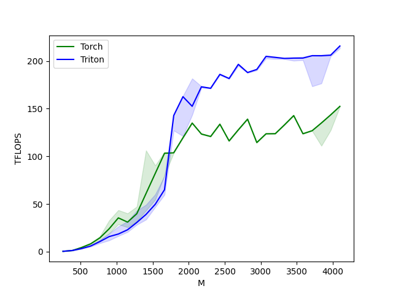
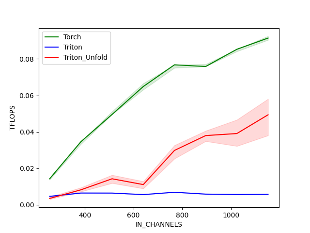

# Triton kernel example
* Configure OpenAI's Triton kernel.
* Ultimately, attempt to build a TTS model based on the Triton kernel.

- [X] Linear
    * Result
    
- [ ] Convolution 1d: **WIP**
    * Result
    
    - [X] Unfold based Convolution 1d
        * Failed. Unfold overhead is very big.
    - [ ] Basic Conv1d
        * The method that the block size of out length is always 1 was failed.
    - [ ] Stride
    - [ ] Dilation
- [ ] Convolution transpose 1d
- [ ] Activation functions
    - [ ] ReLU
    - [ ] LeakyReLU
    - [ ] GeLU
    - [ ] SiLU
    - ETC.
- [ ] Multi head attention
- [ ] Loss term.
    - [ ] Sigmoid
    - [ ] Softmax
    - [ ] MSE
    - [ ] MAE
    - ETC.
